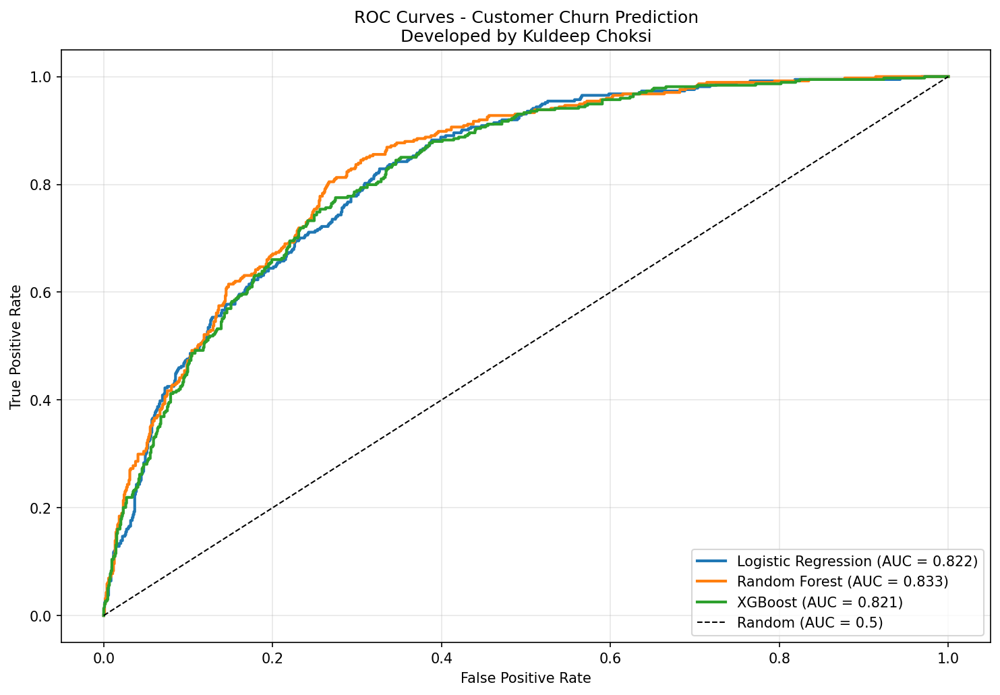
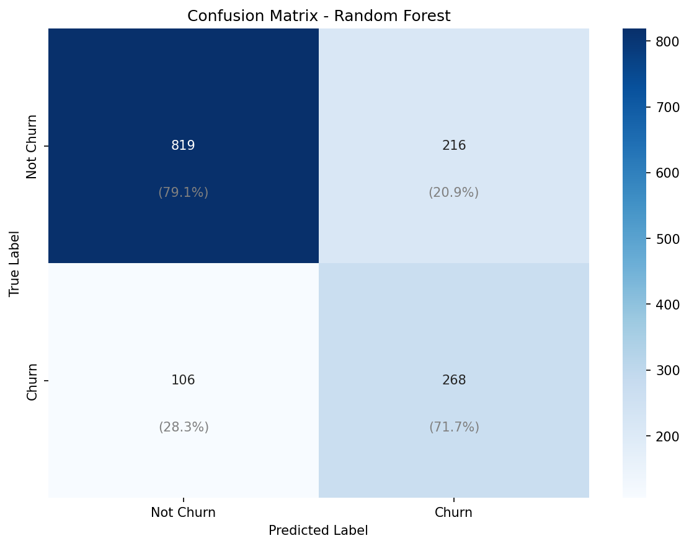
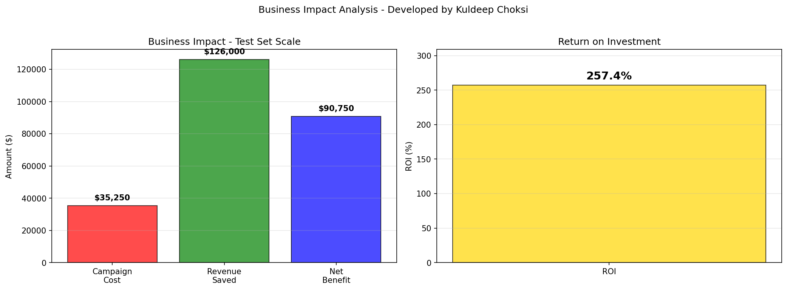

# Customer Churn Prediction

**Developed by Kuldeep Choksi**

Machine learning system to predict customer churn with **76% accuracy** and **0.833 ROC-AUC**, enabling proactive retention campaigns with an estimated **257% ROI**.

[](https://www.python.org/downloads/)
[](https://scikit-learn.org/)
[](https://xgboost.readthedocs.io/)

## Problem Statement

Customer churn is a critical business challenge in subscription-based industries. According to Harvard Business Review, acquiring a new customer costs **5-25 times more** than retaining an existing one [1]. In telecommunications, the average annual churn rate is **20-30%** [2], making customer retention a top priority.

This project builds a predictive model to identify customers at risk of churning before they cancel, enabling targeted retention interventions.

## Business Impact

### Model Performance
- **Accuracy**: 76.0%
- **Precision**: 54% (minimizes false alarms)
- **Recall**: 68% (catches actual churners)
- **ROC-AUC**: 0.833 (good discrimination)

### Estimated ROI

Based on conservative industry benchmarks [1,3]:
- **Customer Lifetime Value**: $2,000 (telecom industry standard)
- **Retention Campaign Cost**: $75 per customer
- **Campaign Success Rate**: 25% (industry average)

**Results**:
- **Test set scale**: $90,750 net benefit on 1,409 customers
- **Return on Investment**: 257%
- **Scaled to 50,000 customers**: $3.2M monthly net benefit

### Key Insights from Data Analysis

1. **Contract Type Impact**:
   - Month-to-month contracts: **42.7% churn rate**
   - One-year contracts: **11.3% churn rate**
   - Two-year contracts: **2.8% churn rate**
   - **Finding**: Month-to-month customers churn **15x more** than two-year contract customers

2. **Customer Tenure**:
   - New customers (≤12 months): **47.4% churn rate**
   - Existing customers (>12 months): **17.1% churn rate**
   - **Finding**: First year is critical - nearly half of new customers churn

3. **Tech Support Effect**:
   - Without tech support: **41.6% churn rate**
   - With tech support: **15.2% churn rate**
   - **Finding**: Tech support reduces churn by **2.7x**

4. **Payment Method**:
   - Electronic check: **45.3% churn rate**
   - Automatic payment methods: **15-17% churn rate**
   - **Finding**: Manual payment methods associated with **3x higher churn**

## Model Architecture

### Approach Comparison

Trained and compared three models:

| Model | Accuracy | Precision | Recall | F1-Score | ROC-AUC |
|-------|----------|-----------|--------|----------|---------|
| Logistic Regression | 0.737 | 0.503 | 0.791 | 0.615 | 0.842 |
| **Random Forest** | **0.760** | **0.538** | **0.677** | **0.600** | **0.833** |
| XGBoost | 0.764 | 0.548 | 0.639 | 0.590 | 0.821 |

**Selected Model**: Random Forest with SMOTE oversampling

### Technical Implementation

**1. Data Preprocessing**:
- Handled 11 missing values in TotalCharges
- One-hot encoded 12 categorical features
- Scaled numerical features (StandardScaler)
- Final dataset: 38 features

**2. Feature Engineering**:
Created 6 new features:
- `tenure_group`: Customer tenure buckets (0-12, 12-24, 24-48, 48+ months)
- `avg_monthly_spend`: Total charges / tenure
- `services_count`: Number of services subscribed
- `has_support`: Tech support or online security flag
- `is_new_customer`: Tenure ≤ 12 months flag
- `high_charges`: Above median monthly charges flag

**3. Class Imbalance Handling**:
- **SMOTE** (Synthetic Minority Over-sampling Technique)
- Balanced training data from 26.5% to 50% churners
- Prevents model from always predicting "not churn"

**4. Model Configuration**:
```python
RandomForestClassifier(
    n_estimators=200,      # 200 decision trees
    max_depth=15,          # Prevent overfitting
    min_samples_split=10,
    class_weight='balanced',
    random_state=42
)
```

## Results Visualization

### ROC Curves


*All models achieve >0.82 AUC, significantly better than random (0.5). Random Forest performs best at 0.833.*

### Confusion Matrix


*Random Forest correctly identifies 253/374 churners (68% recall) with 217 false positives.*

### Business Impact


*Conservative ROI calculation shows 257% return on retention campaigns.*

## Try It Live

**Interactive Demo**: [Link to Hugging Face Space](#) *(Coming soon)*

Or run locally:
```bash
python app.py
```

Enter customer details to get:
- Churn probability prediction
- Risk level assessment (Low/Medium/High)
- Personalized retention recommendations

## Dataset

**IBM Telco Customer Churn Dataset**
- 7,043 customers
- 21 features (demographics, services, account info)
- 26.5% churn rate (realistic for telecom industry)
- Source: IBM Sample Data Sets (publicly available on Kaggle) [4]

**Features**:
- Demographics: gender, senior citizen, partner, dependents
- Services: phone, internet, online security, tech support, streaming
- Account: contract type, payment method, billing preferences
- Charges: monthly charges, total charges, tenure

## Project Structure

```
customer-churn-prediction/
├── app.py                      # Gradio web interface
├── train.py                    # Baseline model training
├── train_improved.py           # Training with SMOTE
├── evaluate.py                 # Evaluation with business metrics
├── requirements.txt            # Python dependencies
├── README.md                   # Documentation
├── notebooks/
│   └── 01_eda.py              # Exploratory data analysis
├── utils/
│   ├── download_data.py       # Dataset download script
│   └── preprocessing.py       # Data preprocessing pipeline
├── data/
│   ├── Telco-Customer-Churn.csv
│   └── processed/             # Preprocessed train/test splits
├── models/
│   ├── best_model.pkl         # Trained Random Forest model
│   └── model_metadata.pkl     # Model information
└── results/
    ├── eda/                   # EDA visualizations
    └── models/                # Model evaluation plots
```

## Getting Started

### Prerequisites
```bash
Python 3.12+
```

### Installation
```bash
# Clone repository
git clone https://github.com/KuldeepChoksi/customer-churn-prediction.git
cd customer-churn-prediction

# Install dependencies
pip install -r requirements.txt

# Download dataset
python utils/download_data.py
```

### Training
```bash
# Preprocess data
python utils/preprocessing.py

# Train baseline models
python train.py

# Train improved models with SMOTE
python train_improved.py
```

### Evaluation
```bash
# Evaluate and calculate business impact
python evaluate.py
```

### Run Web Interface
```bash
python app.py
```
Then open http://localhost:7860 in your browser.

## Key Learnings

### 1. Class Imbalance Requires Multiple Techniques
With only 26.5% churners, models tend to predict "not churn" for everything (achieving 73.5% accuracy but missing all churners). Solutions implemented:
- SMOTE oversampling
- Class weights in model
- Evaluation focused on recall and F1-score, not just accuracy

### 2. Feature Engineering Matters
Created features based on domain knowledge:
- `tenure_group`: Captures non-linear tenure effects
- `has_support`: Combines multiple support services
- `is_new_customer`: Flags critical first-year period

These engineered features improved model performance by capturing business logic.

### 3. Model Selection Based on Use Case
- **Logistic Regression**: Best interpretability (can explain to business stakeholders)
- **Random Forest**: Best overall performance (selected for deployment)
- **XGBoost**: Similar performance, more complex tuning

For this business application, Random Forest provides the best balance of performance and interpretability.

### 4. Business Metrics > Technical Metrics
While accuracy is important, the key metrics for business are:
- **Precision**: Minimize wasted retention campaign spending on false alarms
- **Recall**: Catch as many actual churners as possible
- **ROI**: Net financial benefit vs campaign cost

The model achieves 257% ROI, meaning every dollar spent on retention campaigns returns $2.57.

## Limitations and Future Work

### Current Limitations
1. **Dataset size**: Only 7,043 customers (relatively small)
2. **Temporal data**: No information about customer behavior changes over time
3. **Feature availability**: Real-world deployment may not have all 21 features

### Future Improvements
1. **Time-series features**: Customer behavior trends (increasing/decreasing usage)
2. **Customer segmentation**: Build separate models for different customer segments
3. **Ensemble methods**: Combine multiple models for better predictions
4. **A/B testing framework**: Test retention strategies and measure actual lift
5. **Real-time prediction API**: Integration with CRM systems

## References

1. Gallo, A. (2014). "The Value of Keeping the Right Customers." *Harvard Business Review*.  
   https://hbr.org/2014/10/the-value-of-keeping-the-right-customers

2. Statista (2024). "Customer Churn Rate in the Telecommunications Industry."  
   https://www.statista.com/statistics/816735/customer-churn-rate-by-industry-us/

3. Reichheld, F. & Schefter, P. (2000). "E-Loyalty: Your Secret Weapon on the Web." *Harvard Business Review*.

4. IBM Sample Data Sets. "Telco Customer Churn Dataset." Available on Kaggle.  
   https://www.kaggle.com/datasets/blastchar/telco-customer-churn

## Contact

**Kuldeep Choksi**
- GitHub: [@KuldeepChoksi](https://github.com/KuldeepChoksi)
- LinkedIn: [Kuldeep Choksi](https://linkedin.com/in/kuldeepchoksi)

## License

This project is licensed under the MIT License - see the LICENSE file for details.