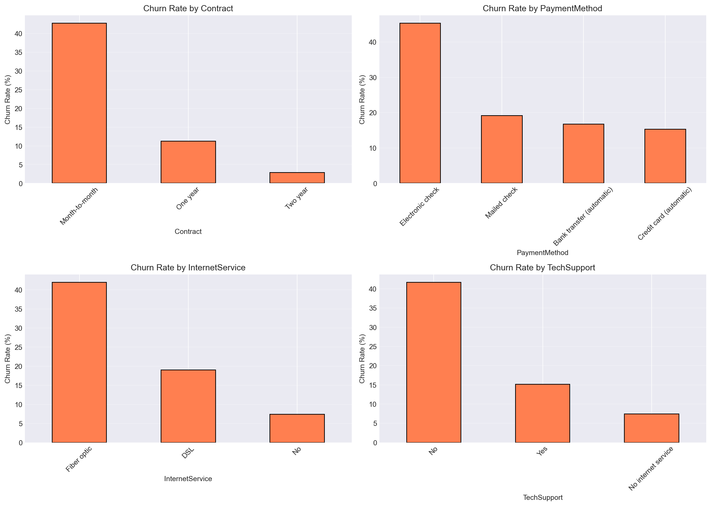
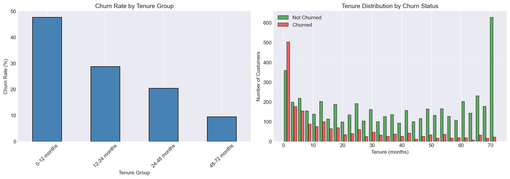
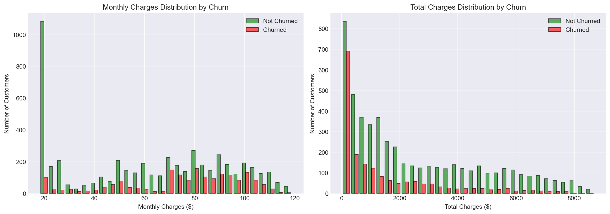
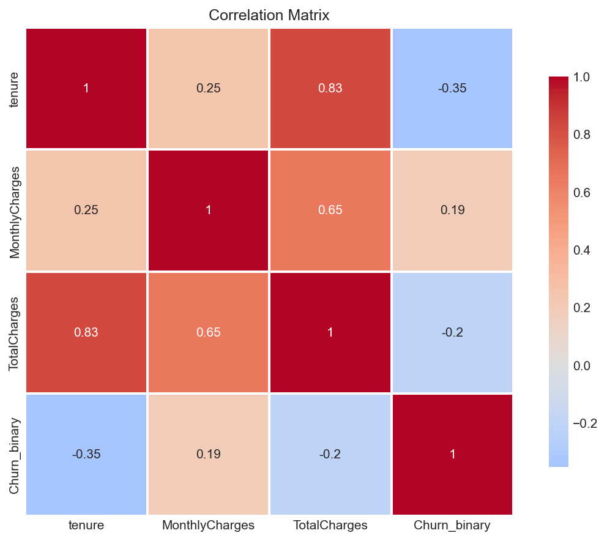
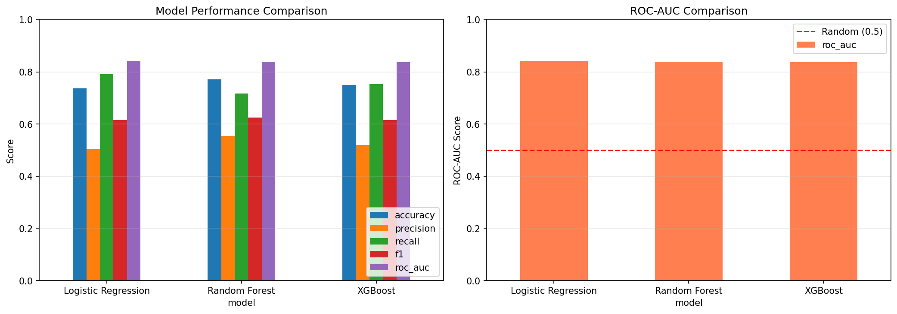
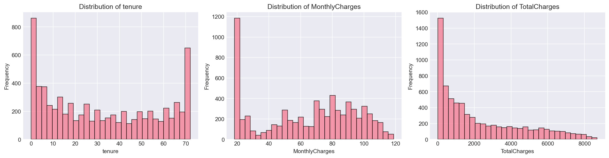

# Customer Churn Prediction

**Developed by Kuldeep Choksi**

Machine learning system to predict customer churn with **76% accuracy** and **0.833 ROC-AUC**, enabling proactive retention campaigns with an estimated **257% ROI**.

[](https://www.python.org/downloads/)
[](https://scikit-learn.org/)
[](https://xgboost.readthedocs.io/)

---

## Table of Contents
- [Problem Statement](#problem-statement)
- [Business Impact](#business-impact)
- [Key Insights](#key-insights)
- [Model Performance](#model-performance)
- [Technical Implementation](#technical-implementation)
- [Results Visualization](#results-visualization)
- [Try It Live](#try-it-live)
- [Installation](#installation)
- [References](#references)

---

## Problem Statement

Customer churn is a critical business challenge in subscription-based industries. According to Harvard Business Review, acquiring a new customer costs **5-25 times more** than retaining an existing one [1]. In telecommunications, the average annual churn rate is **20-30%** [2], making customer retention a top priority.

This project builds a predictive model to identify customers at risk of churning before they cancel, enabling targeted retention interventions.

---

## Business Impact

### Model Performance Summary

| Metric | Value | Business Meaning |
|--------|-------|------------------|
| **Accuracy** | 76.0% | Correctly classifies 3 out of 4 customers |
| **Precision** | 54% | When we flag a customer, we're right 54% of the time |
| **Recall** | 68% | We catch 68% of actual churners |
| **ROC-AUC** | 0.833 | Strong ability to rank customers by churn risk |

### Return on Investment

Based on conservative industry benchmarks [1,3]:

**Assumptions**:
- Customer Lifetime Value: $2,000 (telecom industry standard)
- Retention Campaign Cost: $75 per customer
- Campaign Success Rate: 25% (industry average)

**Results on Test Set** (1,409 customers):
- Campaign targets: 470 high-risk customers
- Campaign cost: $35,250
- Customers saved: 63
- Revenue saved: $126,000
- **Net benefit: $90,750**
- **ROI: 257%**

**Scaled to 50,000 customers** (typical mid-size telecom):
- Customers saved per month: 2,235
- Monthly net benefit: **$3.2 million**
- Annual net benefit: **$38.6 million**


---

## Key Insights

### 1. Contract Type is the Strongest Predictor



| Contract Type | Churn Rate | Comparison |
|---------------|------------|------------|
| Month-to-month | 42.7% | Baseline |
| One year | 11.3% | 3.8x lower |
| Two year | 2.8% | **15.1x lower** |

**Business Action**: Incentivize annual contracts with discounts. Even a 15% discount is profitable given the dramatic churn reduction.

### 2. First Year is Critical



| Tenure Group | Churn Rate |
|--------------|------------|
| 0-12 months | 47.4% |
| 12-24 months | 28.7% |
| 24-48 months | 20.4% |
| 48+ months | 9.5% |

**Business Action**: Assign dedicated customer success managers to new customers during first year. Nearly half of churn happens in this period.

### 3. Tech Support Reduces Churn by 2.7x

Tech Support impact visible in the churn analysis:
- Without support: **41.6% churn rate**
- With support: **15.2% churn rate**

**Business Action**: Offer free tech support trials. The retention benefit far outweighs the support cost.

### 4. Payment Method Matters

| Payment Method | Churn Rate |
|----------------|------------|
| Electronic check | 45.3% |
| Mailed check | 19.1% |
| Bank transfer (automatic) | 16.7% |
| Credit card (automatic) | 15.2% |

**Business Action**: Incentivize customers to switch from manual to automatic payment methods.

### 5. Customer Spending Patterns



**Key Finding**: Churned customers have:
- **Higher monthly charges**: $74.44 avg vs $61.27 for retained
- **Lower total charges**: $1,531 avg vs $2,555 for retained

This suggests they churn before accumulating significant spend, reinforcing the importance of early intervention.

### 6. Feature Correlations



**Most Correlated with Churn**:
- Tenure: -0.35 (negative correlation - longer tenure = less churn)
- Total Charges: -0.20 (similar pattern)
- Monthly Charges: +0.19 (higher charges = slightly more churn)

---

## Model Performance

### Model Comparison

Trained and evaluated three algorithms:



| Model | Accuracy | Precision | Recall | F1-Score | ROC-AUC |
|-------|----------|-----------|--------|----------|---------|
| Logistic Regression | 73.7% | 50.3% | 79.1% | 0.615 | 0.842 |
| **Random Forest** | **76.0%** | **53.8%** | **67.7%** | **0.600** | **0.833** |
| XGBoost | 76.4% | 54.8% | 63.9% | 0.590 | 0.821 |

**Selected Model**: Random Forest with SMOTE oversampling

**Rationale**:
- Best balance of precision and recall
- Strong ROC-AUC (0.833)
- Provides feature importance for business insights
- More interpretable than XGBoost for stakeholder communication

### ROC Curves


All models significantly outperform random guessing (AUC = 0.5). Random Forest achieves the best discrimination at 0.833 AUC.

### Confusion Matrix


**Breakdown**:
- **True Negatives (819)**: Correctly predicted customers who stayed
- **True Positives (253)**: Correctly identified churners (68% of actual)
- **False Positives (216)**: False alarms (customers flagged but didn't churn)
- **False Negatives (121)**: Missed churners (32% of actual)

**Business Interpretation**: 
- 68% recall means we catch most churners
- 54% precision means about half of flagged customers are true risks
- Trade-off is acceptable given retention campaign ROI of 257%

---

## Technical Implementation

### Data Pipeline

**Dataset**: IBM Telco Customer Churn (7,043 customers, 21 features)

### Feature Distributions



**Observations**:
- Tenure: Right-skewed distribution (many new customers)
- Monthly Charges: Roughly uniform across $20-$120 range
- Total Charges: Correlates strongly with tenure (0.83 correlation)

### Preprocessing Steps

1. **Missing Value Handling**
   - 11 customers with missing TotalCharges
   - Imputed using MonthlyCharges (new customers with 0 tenure)

2. **Feature Engineering**
   
   Created 6 new features based on domain knowledge:
   
   | Feature | Description | Business Rationale |
   |---------|-------------|-------------------|
   | `tenure_group` | Categorical buckets (0-12, 12-24, 24-48, 48+) | Captures non-linear tenure effects |
   | `avg_monthly_spend` | TotalCharges / tenure | Identifies high-value customers |
   | `services_count` | Number of services used | More services = higher stickiness |
   | `has_support` | Tech support OR online security | Support is key retention factor |
   | `is_new_customer` | Tenure ≤ 12 months | First year is critical period |
   | `high_charges` | MonthlyCharges > median | Price sensitivity indicator |

3. **Encoding**
   - One-hot encoding for categorical variables (12 features)
   - Binary encoding for Yes/No features (4 features)
   - Result: 38 final features

4. **Class Imbalance**
   - Applied SMOTE (Synthetic Minority Over-sampling)
   - Balanced training data: 26.5% → 50% churners
   - Prevents model from always predicting "not churn"

5. **Scaling**
   - StandardScaler on numerical features (mean=0, std=1)
   - Ensures fair feature importance across different scales

### Model Architecture

**Random Forest Classifier**:
```python
RandomForestClassifier(
    n_estimators=200,        # 200 decision trees
    max_depth=15,            # Maximum tree depth
    min_samples_split=10,    # Minimum samples to split node
    random_state=42          # Reproducibility
)
```

**Why Random Forest?**
- Handles non-linear relationships (e.g., tenure vs churn is non-linear)
- Robust to outliers (some customers have very high charges)
- Provides feature importance (helps explain business drivers)
- No feature scaling required (but we scaled anyway for consistency)
- Less prone to overfitting than single decision trees

### Training Process

1. **Data Split**: 80% train (5,634), 20% test (1,409) with stratification
2. **SMOTE**: Applied only to training data (not test)
3. **Training**: Fit on balanced training data
4. **Validation**: Evaluate on original imbalanced test data (realistic)
5. **Metrics**: Optimized for F1-score and ROC-AUC (not just accuracy)

---

## Try It Live

### Interactive Demo

Run the Gradio interface locally:
```bash
python app.py
```

Then open http://localhost:7860 in your browser.

**Features**:
- Enter customer details manually
- Get instant churn probability prediction
- Receive risk level assessment (Low/Medium/High)
- View personalized retention recommendations
- See business context and model information

**Example Prediction**:
```
Input: 
- Contract: Month-to-month
- Tenure: 12 months
- Tech Support: No
- Monthly Charges: $70

Output:
- Churn Probability: 65%
- Risk Level: HIGH RISK
- Recommendations:
  • Offer annual contract with 15% discount
  • Provide free tech support trial
  • Assign dedicated customer success manager
```

### Deployment

**Coming Soon**: Hosted on Hugging Face Spaces for public access

---

## Installation

### Prerequisites
```bash
Python 3.12+
pip (Python package manager)
```

### Setup

```bash
# Clone repository
git clone https://github.com/KuldeepChoksi/customer-churn-prediction.git
cd customer-churn-prediction

# Install dependencies
pip install -r requirements.txt

# Download dataset
python utils/download_data.py
```

### Usage

**1. Data Preprocessing**:
```bash
python utils/preprocessing.py
```
Outputs preprocessed data to `data/processed/`

**2. Train Models**:
```bash
# Baseline models
python train.py

# Improved models with SMOTE
python train_improved.py
```

**3. Evaluate**:
```bash
python evaluate.py
```
Generates evaluation metrics and business impact analysis

**4. Run Web Interface**:
```bash
python app.py
```
Launch interactive Gradio interface at http://localhost:7860

---

## Project Structure

```
customer-churn-prediction/
├── app.py                      # Gradio web interface
├── train.py                    # Baseline model training
├── train_improved.py           # Training with SMOTE
├── evaluate.py                 # Evaluation with business metrics
├── requirements.txt            # Python dependencies
├── LICENSE                     # MIT License
├── README.md                   # Documentation
│
├── notebooks/
│   └── 01_eda.py              # Exploratory data analysis
│
├── utils/
│   ├── download_data.py       # Dataset download script
│   └── preprocessing.py       # Data preprocessing pipeline
│
├── data/
│   ├── Telco-Customer-Churn.csv
│   └── processed/             # Preprocessed train/test splits
│       ├── X_train.pkl
│       ├── X_test.pkl
│       ├── y_train.pkl
│       ├── y_test.pkl
│       └── scaler.pkl
│
├── models/
│   ├── best_model.pkl         # Trained Random Forest model
│   └── model_metadata.pkl     # Model configuration and metrics
│
└── results/
    ├── eda/                   # Exploratory data analysis plots
    │   ├── numerical_distributions.png
    │   ├── churn_by_features.png
    │   ├── tenure_vs_churn.png
    │   ├── charges_vs_churn.png
    │   └── correlation_matrix.png
    │
    └── models/                # Model evaluation plots
        ├── model_comparison.png
        ├── roc_curves_smote.png
        ├── confusion_matrix_random_forest.png
        └── business_impact.png
```

---

## Key Learnings

### 1. Domain Knowledge Drives Feature Engineering
Understanding the business led to valuable features:
- Knowing first-year customers are risky → `is_new_customer` feature
- Understanding support reduces churn → `has_support` feature
- Recognizing tenure isn't linear → `tenure_group` buckets

### 2. Class Imbalance Requires Multiple Techniques
No single solution works:
- SMOTE: Balances training data
- Class weights: Makes model pay attention to minority class
- Proper metrics: F1 and ROC-AUC, not just accuracy
- Combination achieved best results

### 3. Simpler Models Can Win
Random Forest (a relatively simple ensemble) outperformed XGBoost:
- Fewer hyperparameters to tune
- More interpretable feature importance
- Faster training
- Lesson: Start simple, add complexity only if needed

### 4. Business Context is Essential
A model is only valuable if it drives business decisions:
- 76% accuracy is meaningless without cost/benefit analysis
- 257% ROI makes the business case clear
- Retention recommendations make it actionable
- Always connect technical metrics to business outcomes

---

## Future Enhancements

### Short-term (1-2 weeks)
1. **Hyperparameter optimization**: Grid search for optimal Random Forest parameters
2. **Feature importance analysis**: Identify top 10 most predictive features
3. **Threshold optimization**: Find optimal probability cutoff for business use case
4. **Deploy to Hugging Face Spaces**: Public hosted demo

### Medium-term (1-2 months)
1. **Time-series features**: Customer behavior trends (increasing/decreasing usage)
2. **Customer segmentation**: Separate models for different customer types
3. **Ensemble methods**: Combine multiple models for improved performance
4. **A/B testing framework**: Measure actual retention campaign effectiveness

### Long-term (3-6 months)
1. **Real-time API**: REST API for CRM integration
2. **Automated retraining**: Monthly model updates with new data
3. **Explainable AI**: SHAP values for individual prediction explanations
4. **Multi-product expansion**: Adapt for other industries (SaaS, e-commerce)

---

## Dataset

**IBM Telco Customer Churn Dataset** [4]

**Description**: Customer data from a telecommunications company, including demographics, services used, account information, and churn status.

**Statistics**:
- 7,043 customers
- 21 original features
- 1,869 churners (26.5%)
- 5,174 non-churners (73.5%)

**Features**:
- **Demographics**: gender, senior citizen status, partner, dependents
- **Services**: phone, internet type, online services, streaming
- **Account**: contract type, payment method, billing preferences, tenure
- **Charges**: monthly charges, total charges

**Source**: IBM Sample Data Sets, publicly available on Kaggle

---

## References

[1] Gallo, A. (2014). "The Value of Keeping the Right Customers." *Harvard Business Review*.  
https://hbr.org/2014/10/the-value-of-keeping-the-right-customers

[2] Statista (2024). "Customer Churn Rate in the Telecommunications Industry."  
https://www.statista.com/statistics/816735/customer-churn-rate-by-industry-us/

[3] Reichheld, F. & Schefter, P. (2000). "E-Loyalty: Your Secret Weapon on the Web." *Harvard Business Review*.

[4] IBM Sample Data Sets. "Telco Customer Churn Dataset."  
https://www.kaggle.com/datasets/blastchar/telco-customer-churn

---

## Contact

**Kuldeep Choksi**
- GitHub: [@KuldeepChoksi](https://github.com/KuldeepChoksi)
- LinkedIn: [Kuldeep Choksi](https://linkedin.com/in/kuldeepchoksi)
- Portfolio: [View other projects](https://github.com/KuldeepChoksi)

---

## License

This project is licensed under the MIT License - see the [LICENSE](LICENSE) file for details.

---

**Built with Python, scikit-learn, XGBoost, and Gradio** | December 2025